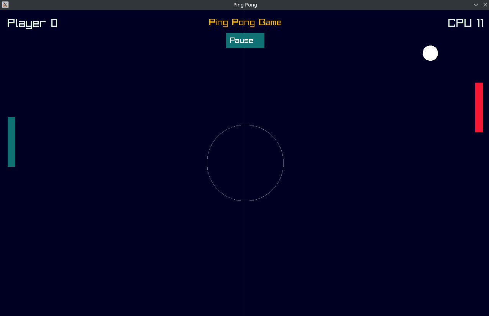

# Ping Pong Raylib

This is a simple Ping Pong game built using C++ and the Raylib library.



## Prerequisites

Before running the project, ensure you have the following installed on your system:

1. **C++ Compiler**: A compiler like `g++` is required to build the project.
2. **Raylib Library**: Install Raylib on your system. You can install it using your package manager or build it from source. For example, on Ubuntu, you can install it using:
   ```bash
   sudo apt install libraylib-dev # for apt package managers
   sudo pacman -S raylib # for arch based distros
   ```


## How to Build and Run

1. Clone or download the project to your local machine:
   ```bash
   git clone git@github.com:Gowthamr221/pingpong_raylib.git
   cd pingpong_raylib
   ```

2. Build the project using the provided `Makefile`:
   ```bash
   make build
   ```

3. Run the game:
   ```bash
   ./main
   ```

## Controls

- **Arrow Up**: Move the player's paddle up.
- **Arrow Down**: Move the player's paddle down.
- **Mouse Click**: Pause or resume the game.

## Features

- Player vs CPU gameplay.
- Pause and resume functionality.
- Score tracking for both the player and CPU.

## License

This project is licensed under the MIT License. See the [LICENSE](./LICENSE) file for details.